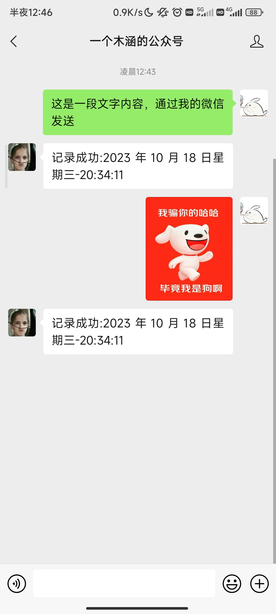
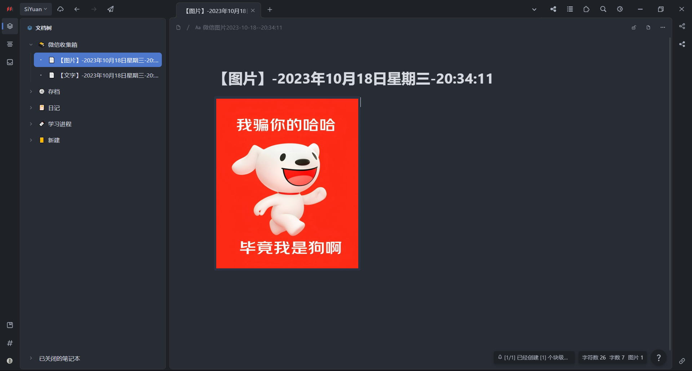
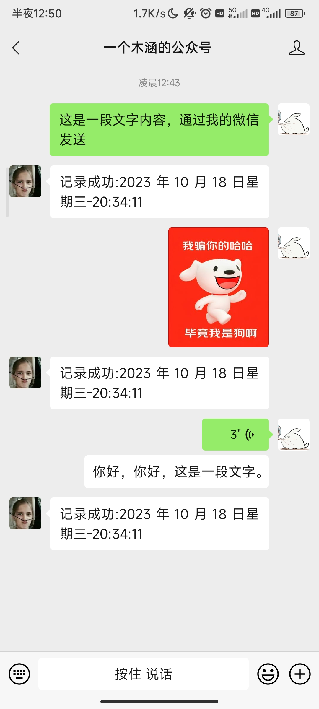
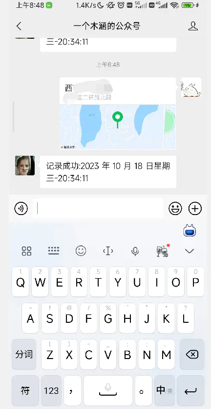
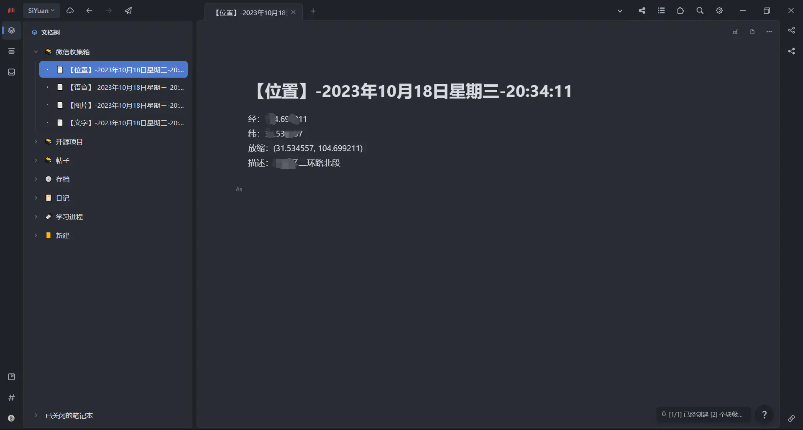

# 这是一个简单但功能齐全的自制思源笔记微信收集箱
## 介绍：

思源笔记和微信重度使用者？免费微信笔记收集箱？敏感消息不想经过别人的手？有很多不同的消息想收集？想完全自定义自己的微信工具箱？有服务器闲置没事干？

好的，那么你来对地方了！

本项目可以为你制作一个完全的属于自己的微信收集箱。

详细搭建教程：[https://doc.muhan.studio/#/siyuan-wxbox](https://doc.muhan.studio/#/siyuan-wxbox)

## 演示图：

文字：

​​

​​

图片：

​​

​​

语音（自动识别成文字）：

​​

​

位置信息（自动解析经纬度以及地名，显示地图放缩倍数）：

​​

​​

感谢[https://github.com/offu/WeRoBot](https://github.com/offu/WeRoBot)提供的基础架构

需要深度自己开发的，可以阅读其官方文档

[Message — WeRoBot 1.13.1 文档](https://werobot.readthedocs.io/zh_CN/latest/messages.html)
